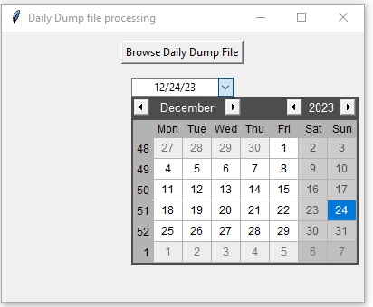

# Daily-Complaint-Report-Automation

A desktop app which automates the `Daily Complaint Report` of `Service Assurance Department` of the telecommunications company `Banglalink` located in Bangladesh.

This report has served to the whole technology team of Banglalink. All the team under the technology department gets a summaried idea about the `voice & data complaint` as well as the `hiked region/sales zone`. They also can compare the hike ratio from the data. It provides a brief idea about `RAN`, `BSM` and `Core` related complaint and the current status of the complaint. Overall, it will help the technology team members (around 200+) to take actions immediately against the customer complaint.

# Benefits

By automating the report company and technology department will get the below benefits-

1. Reduce total **2-3 hours** of workload to **10-15 minutes**
2. Indirectly responsible to gain more revenue
3. Serve the report quickly to all technology department
4. Help to solve customer complaint quickly
5. Team members can focus on other issues too
6. Easily portable
7. No need to carry codes
8. Easy to interect with user interface

# Technologies used

1. `Python` as programming language
2. `Openpyxl` to interect with excel file and do load, read, write and modify oeprations on the workbooks and worksheets
3. `Pywin32` to make the `pivot table` from scratch in the excel sheet
4. `tkinter` library for the user interface
5. `PyInstaller` to build the `.exe` file
6. `Pandas` library to clean the `lat-long` of fake customer complaint

# Desktop Application User Interface

User interface of `daily_dump.exe` and `regional_with_sales_zone.exe`are given below-
  

  

  

  

# Run the application

The whole process is divided into two parts. They are-

1. `Daily Dump` file to `Regional` file generation
2. `Regional` file to `Daily Technology` file fillup

To run the two parts there is two seperate `.exe` file. `daily_dump.exe` is for the first part. On the other hand, `regional_with_sales_zone.exe` is for the 2nd half. For the 1st part, you need to place `Category team`, `Daily Dump`. And for the 2nd half, `regional_with_sales_zone.exe` requires `Site to CC`, `Regional`, `Daily Technology` to be in the same folder as the executable file. Here, `Site to CC` file need to produce manually using different software.

**N.B** - Just double-click on the `executable` file one after another to run the whole process.

